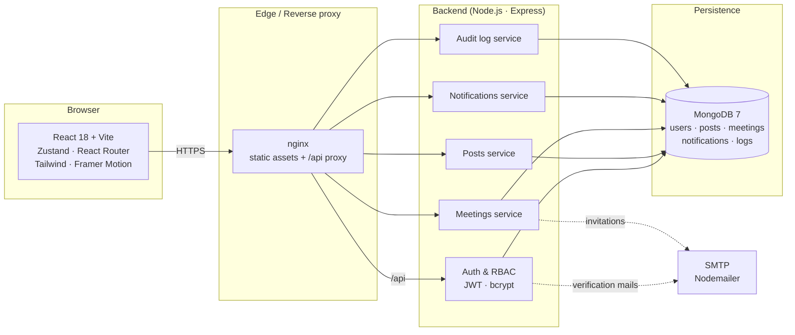

<div align="center">

# HEALTH AI — Co-Creation Platform

### Where clinicians and engineers co-create medical AI — safely, auditably, together.

A full-stack, GDPR-aware matchmaking platform that connects **healthcare professionals** and **AI / ML engineers** across Europe so they can move from idea to pilot inside a single, structured workspace.

[](#license)
[](#)
[](#)
[](#)
[](#)
[](#)
[](#-quick-start)
[](#-contributing)
[](https://github.com/berkekus/healthai-co-creation-platform/stargazers)

[**Live demo**](#-demo) · [**API docs**](backend/API.md) · [**Architecture**](#-architecture) · [**Roadmap**](backend/ROADMAP.md) · [**Report a bug**](https://github.com/berkekus/healthai-co-creation-platform/issues)

</div>

---

## Table of contents

- [Why this project?](#-why-this-project)
- [Demo](#-demo)
- [Features](#-features)
- [Tech stack](#-tech-stack)
- [Architecture](#-architecture)
- [Quick start](#-quick-start)
- [Environment variables](#-environment-variables)
- [Project structure](#-project-structure)
- [API reference](#-api-reference)
- [Demo accounts](#-demo-accounts)
- [Testing](#-testing)
- [Deployment](#-deployment)
- [Roadmap](#-roadmap)
- [Contributing](#-contributing)
- [License](#license)
- [Acknowledgements](#-acknowledgements)

---

## Why this project?

Building useful medical AI is hard — not because the models are missing, but because **the right people rarely meet at the right time**. Clinicians have problems and data; engineers have skills and curiosity; institutions have legal requirements that can stall any pilot for months.

**HEALTH AI** is a structured co-creation workspace that removes that friction:

- **A common ground.** A single platform where engineers and healthcare professionals publish needs and capabilities in a consistent, searchable format.
- **Auditable from day one.** Every action — registration, post creation, meeting request, account deletion — is recorded in a tamper-evident audit log with a 24-month retention policy.
- **GDPR by design.** Lawful basis (Art. 6), data export (Art. 20), right to erasure (Art. 17), cookie consent and a privacy policy ship in the box.
- **Smart matching, not blind search.** Posts are ranked using a transparent matching engine that explains *why* two users were paired (city, country, cross-role, expertise overlap).

> Originally built as a SENG 384 capstone project — designed and engineered to production-grade standards.

---

## Demo

> Screenshots and a short demo GIF will be embedded here. Run `docker compose up` locally to walk through every flow end-to-end.

| Landing | Dashboard | Smart matching | Meeting workflow |
| :-----: | :-------: | :------------: | :--------------: |
|  *soon*  |  *soon*   |    *soon*      |     *soon*       |

---

## Features

<table>
<tr><td valign="top" width="50%">

### Core product
- **Authentication** — email + password · `.edu` verification · session timeout (30 min) with countdown · rate limiting after 3 failed attempts
- **Post lifecycle** — `draft` → `published` → `partner_found` (or `expired` / `closed`) with confidentiality flags (public pitch vs. meeting-only)
- **Smart matching** — per-card match chips (city · country · cross-role · expertise overlap) plus a "Best matches for you" featured row
- **Meeting workflow** — 3-step interest flow (message → NDA → 3 proposed slots) · owner accept / counter-propose / decline · tabbed inbox
- **Real-time notifications** — push-style notifications with polling, unread count, mark-as-read, bulk actions
- **Admin panel** — user suspension · post moderation · audit log with filters and CSV export

</td><td valign="top" width="50%">

### Compliance & quality
- **GDPR-ready** — Art. 6 legal basis · Art. 15 / 17 / 20 / 21 user rights · JSON data export · account deletion · cookie consent banner
- **Security** — JWT auth · bcrypt password hashing · `helmet` · rate limiting · `express-mongo-sanitize` · CORS allowlist
- **Tamper-evident audit log** — every privileged action is logged with `userId · userEmail · role · action · ipAddress · result`
- **Accessibility** — semantic landmarks · keyboard-reachable cards · ARIA on every modal · WCAG AA color pairings · `prefers-reduced-motion` support
- **Testing** — Vitest + Supertest on the backend (in-memory MongoDB) · Vitest + Testing Library on the frontend
- **DX** — fully typed REST contract shared between client and server · single `docker compose up` for the whole stack

</td></tr>
</table>

---

## Tech stack

| Layer        | Technologies |
| ------------ | ------------ |
| **Frontend** | React 18 · TypeScript 5 · Vite 6 · Tailwind CSS 3 · React Router 6 · Zustand · React Hook Form + Zod · Framer Motion · Lucide |
| **Backend**  | Node.js 20 · Express 4 · TypeScript 5 · Mongoose 8 |
| **Database** | MongoDB 7 |
| **Security** | JWT · bcryptjs · Helmet · `express-rate-limit` · `express-mongo-sanitize` · CORS |
| **Email**    | Nodemailer (SMTP — Gmail, SES, Mailgun…) |
| **Tooling**  | Docker · Docker Compose · Vitest · Supertest · `mongodb-memory-server` · Testing Library |

---

## Architecture



**Key design principles**

- **One contract, two sides.** The TypeScript types in `frontend/src/types` and `backend/models` describe exactly the same entities. Adding a field is a single PR.
- **Stateless API + JWT.** No server-side sessions; horizontal scaling is just "add another container".
- **Audit log as a first-class citizen.** Every privileged write goes through `services/logService` so the admin tab and CSV export work without extra wiring.
- **Role-aware UI.** Route guards in `router/AppRouter.tsx` send unauthorised visitors to a designed `403` page, not a silent redirect — so it's always obvious *why* something is blocked.

---

## Quick start

### Option 1 — Docker (recommended)

```bash
git clone https://github.com/berkekus/healthai-co-creation-platform.git
cd healthai-co-creation-platform

cp backend/.env.example backend/.env
cp frontend/.env.example frontend/.env

docker compose up --build
```

Then open:

- Frontend → http://localhost:5173
- Backend  → http://localhost:5000/api/health

### Option 2 — Run locally without Docker

You will need **Node.js 20+** and a running **MongoDB 7** instance.

```bash
# Backend
cd backend
cp .env.example .env       # set MONGO_URI + JWT_SECRET
npm install
npm run dev                # http://localhost:5000

# Frontend (in a second terminal)
cd frontend
cp .env.example .env       # set VITE_API_URL
npm install
npm run dev                # http://localhost:5173
```

### Option 3 — Production build with Docker

```bash
JWT_SECRET="$(openssl rand -hex 32)" \
CLIENT_ORIGIN="https://your.domain" \
docker compose -f docker-compose.prod.yml up -d --build
```

This brings up `mongodb` + a compiled Node.js backend + a static `nginx` frontend serving the build artefacts and proxying `/api` to the backend.

---

## Environment variables

### Backend (`backend/.env`)

| Variable          | Required | Default                              | Description |
| ----------------- | :------: | ------------------------------------ | ----------- |
| `PORT`            |          | `5000`                               | HTTP port |
| `MONGO_URI`       | yes      | `mongodb://localhost:27017/healthai` | MongoDB connection string |
| `JWT_SECRET`      | yes      | —                                    | Use a long random string in production |
| `JWT_EXPIRES_IN`  |          | `7d`                                 | Token lifetime |
| `NODE_ENV`        |          | `development`                        | `development` \| `production` |
| `CLIENT_ORIGIN`   |          | `http://localhost:5173`              | CORS allowlist |
| `SMTP_HOST` …     |          | empty                                | When unset, e-mails are logged to the console |
| `APP_BASE_URL`    |          | `http://localhost:5173`              | Used in e-mail links |

### Frontend (`frontend/.env`)

| Variable                | Required | Default                       | Description |
| ----------------------- | :------: | ----------------------------- | ----------- |
| `VITE_API_URL`          | yes      | `http://localhost:5000/api`   | Backend base URL |
| `VITE_GEMINI_API_KEY`   |          | —                             | Optional — enables the AI assistant features |

---

## Project structure

```
healthai-co-creation-platform/
├── backend/
│   ├── src/                # app.ts · index.ts (entry points)
│   ├── routes/             # auth · posts · meetings · notifications · logs
│   ├── controllers/        # request handlers
│   ├── services/           # business logic (logService, mailService, …)
│   ├── models/             # Mongoose schemas: User · Post · Meeting · Notification · Log
│   ├── middleware/         # auth · admin · rate limiters · error handler
│   ├── tests/              # Vitest + Supertest + mongodb-memory-server
│   ├── API.md              # full REST reference
│   └── ROADMAP.md          # backend delivery plan
├── frontend/
│   ├── src/
│   │   ├── pages/          # auth · dashboard · posts · meetings · admin · profile · errors
│   │   ├── components/     # layout · posts · meetings · ui primitives
│   │   ├── store/          # Zustand slices: auth · post · meeting · notification
│   │   ├── router/         # AppRouter with protected & role-guarded routes
│   │   ├── utils/          # matchPosts · formatters · validation
│   │   ├── types/          # shared TS contract types
│   │   └── data/           # seed users · posts · meetings · logs
│   └── README.md           # frontend-only deep dive
├── docker-compose.yml      # local development
├── docker-compose.prod.yml # production stack (mongo + backend + nginx)
└── README.md               # you are here
```

---

## API reference

The full REST contract — request bodies, response envelopes, error codes — lives in **[`backend/API.md`](backend/API.md)**.

A quick taste:

```http
POST /api/auth/register
Content-Type: application/json

{
  "name": "Dr. Jane Smith",
  "email": "jane@university.edu",
  "password": "password123",
  "role": "healthcare_professional",
  "institution": "Charité Berlin",
  "city": "Berlin",
  "country": "Germany"
}
```

```json
{
  "success": true,
  "data": {
    "user": { "id": "664f…", "role": "healthcare_professional", "isVerified": true },
    "token": "eyJhbGciOi…"
  }
}
```

All responses follow the same envelope:

```jsonc
{ "success": true,  "data": { /* … */ } }
{ "success": false, "message": "Human-readable reason" }
```

---

## Demo accounts

The frontend ships with realistic seed data (5 users · 10 posts · 7 meetings · 20 audit log entries). Sign in via `/login`.

| Email                    | Role                    | City      | Highlights                                                 |
| ------------------------ | ----------------------- | --------- | ---------------------------------------------------------- |
| `e.muller@charite.edu`   | Healthcare professional | Berlin    | 2 active posts · 1 confirmed meeting · GDPR data-export    |
| `m.rossi@polimi.edu`     | Engineer                | Barcelona | FL framework post · incoming stroke-unit collab request    |
| `i.larsson@ki.edu`       | Healthcare professional | Stockholm | Oncology + ophthalmology posts · 3 pending meetings        |
| `k.nakamura@tum.edu`     | Engineer                | Berlin    | Wearable fall-detector · mental-health NLP post            |
| `admin@healthai.edu`     | Admin                   | Amsterdam | Full admin panel · users / posts / logs · CSV export       |

> Default password is `password123` for users and `admin123` for admin.

---

## Testing

```bash
# Backend — Vitest + Supertest, in-memory MongoDB
cd backend
npm test
npm run test:coverage

# Frontend — Vitest + Testing Library
cd frontend
npm test
```

A scripted smoke test that exercises the full happy path (register → login → create post → publish → request meeting → accept) is also available:

```bash
cd backend
npm run smoke
```

---

## Deployment

The repository ships with two Compose files:

- **`docker-compose.yml`** — local development with hot reload (frontend on `:5173`, backend on `:5000`)
- **`docker-compose.prod.yml`** — production stack: MongoDB 7 + compiled Node.js backend + static `nginx` frontend (`:80`) that proxies `/api` to the backend

Suggested production checklist:

- [ ] Set a strong `JWT_SECRET` (`openssl rand -hex 32`)
- [ ] Point `CLIENT_ORIGIN` to your real domain
- [ ] Configure SMTP (`SMTP_HOST`, `SMTP_USER`, `SMTP_PASS`, `SMTP_FROM`) so verification e-mails are sent
- [ ] Put the stack behind HTTPS (Caddy / Traefik / nginx with Let's Encrypt)
- [ ] Schedule MongoDB backups for the `mongo_data` volume

---

## Roadmap

- [x] Authentication, role-based access, account suspension
- [x] Post lifecycle (draft → published → partner_found)
- [x] Meeting workflow with NDA + slot proposals
- [x] Notification service with polling + unread count
- [x] Admin panel with audit log + CSV export
- [x] GDPR data export & account deletion
- [ ] Real-time notifications via WebSocket / Server-Sent Events
- [ ] Public profile pages with portfolio uploads
- [ ] AI-assisted post drafting (Gemini)
- [ ] i18n (EN · TR · DE) and RTL support
- [ ] OpenAPI 3.1 schema + auto-generated client

A more detailed, phase-by-phase plan lives in **[`backend/ROADMAP.md`](backend/ROADMAP.md)**.

---

## Contributing

Contributions, issues and feature requests are very welcome. The short version:

1. **Fork** the repo and create your branch from `main` (e.g. `feat/post-tags`).
2. Run the relevant test suite (`npm test` in `backend/` and/or `frontend/`).
3. Follow the existing TypeScript / ESLint conventions — descriptive names, no dead code.
4. Open a pull request with a clear description of *what* changed and *why*.

If you are planning a non-trivial change, please open an issue first so we can align on scope.

> Found a security issue? Please **do not** open a public issue — e-mail the maintainers instead.

---

## License

Distributed under the **MIT License**. See [`LICENSE`](LICENSE) for the full text.

---

## Acknowledgements

- Built with React, Vite, Tailwind, Express and MongoDB — and the open-source ecosystems around them.
- Typography: **Plus Jakarta Sans** (headlines) + **Source Sans 3** (body) via Google Fonts.
- Icons: **Material Symbols Outlined** + **Lucide**.
- Originally created as a SENG 384 capstone project (Spring 2026).

<div align="center">

**If this project helped you, consider leaving a ⭐ — it really helps others discover it.**

</div>
