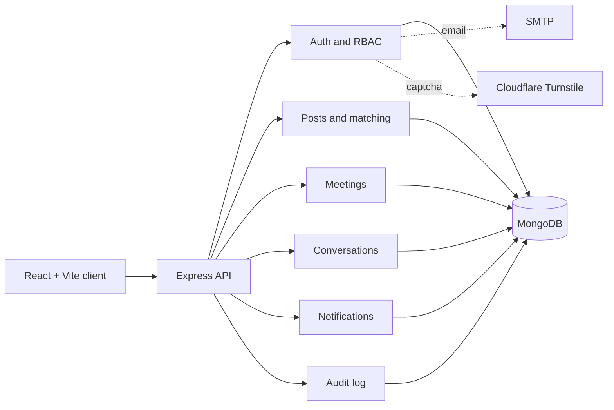

<div align="center">
  


# HealthAI Co-Creation Platform

### A GDPR-aware collaboration space for clinicians and AI engineers.

HealthAI helps healthcare professionals and engineers discover each other, publish collaboration opportunities, schedule NDA-backed meetings, and continue the conversation in one structured workspace.

[](#project-status)
[](LICENSE)
[](#tech-stack)
[](#tech-stack)
[](#tech-stack)
[](#quick-start)

[Quick Start](#quick-start) | [Features](#features) | [Architecture](#architecture) | [API](backend/API.md) | [Roadmap](#roadmap)

</div>

---

## Overview

Medical AI projects often fail before they begin: clinicians know the real problems, engineers know how to build, and institutions need a trustworthy process. HealthAI is designed as that process.

The platform provides:

- Role-based onboarding for healthcare professionals, engineers, and admins.
- Structured opportunity posts with lifecycle states and smart match signals.
- NDA-first meeting requests with proposed time slots.
- Private conversations after a meeting is confirmed.
- Notifications, saved posts, public profiles, admin moderation, and audit logs.
- Accessibility and GDPR-oriented product flows built into the UI.

> Originally built as a SENG 384 capstone project, with production-style architecture and developer tooling.

---

## Project Status

| Area | Status |
| --- | --- |
| Authentication and RBAC | Stable |
| Posts, matching, saved posts | Stable |
| Meetings and NDA flow | Stable |
| Messaging and notifications | Stable |
| Admin dashboard and audit log | Stable |
| Accessibility pass | Active |
| AI-assisted drafting | Experimental |
| Production Docker stack | Ready |

---

## Features

### Product

- **Authentication:** email/password login, `.edu` account flow, Turnstile CAPTCHA, idle session timeout.
- **Smart post discovery:** browse, filter, sort, save, and inspect collaboration opportunities.
- **Match explanations:** city, country, role, domain, and expertise signals are shown directly on post cards.
- **Meeting workflow:** send interest, accept NDA, propose slots, accept/decline/cancel/complete meetings.
- **Messaging:** confirmed meetings automatically unlock a private conversation.
- **Notifications:** unread counts, dropdown preview, notification center, mark-all-read actions.
- **Public profiles:** inspect role, institution, bio, and expertise from post author cards.
- **Admin tools:** user verification, suspension, moderation, audit logs, and CSV exports.

### Quality

- **GDPR-minded flows:** cookie consent, data export, account deletion, privacy copy, audit trail.
- **Security basics:** JWT, bcrypt, Helmet, CORS allowlist, rate limiting, Mongo sanitization.
- **Accessibility:** semantic dialogs, focus traps, visible focus rings, keyboard-reachable interactive rows, reduced-motion coverage.
- **Dark mode:** system-wide theme toggle with persisted preference.
- **Testing:** Vitest for both frontend and backend; Supertest with in-memory MongoDB for API tests.

---

## Tech Stack

| Layer | Technologies |
| --- | --- |
| Frontend | React 18, TypeScript, Vite, Tailwind CSS, React Router, Zustand, React Hook Form, Zod, Framer Motion, Lucide |
| Backend | Node.js, Express, TypeScript, Mongoose, Pino, node-cron |
| Database | MongoDB 7 |
| Security | JWT, bcrypt, Helmet, express-rate-limit, express-mongo-sanitize, Cloudflare Turnstile |
| Email | Nodemailer / SMTP |
| AI | Google Generative AI SDK, optional Gemini integration |
| Tooling | Docker Compose, Vitest, Supertest, Testing Library |

---

## Architecture


```mermaid
flowchart LR
  Browser["React + Vite client"] --> API["Express API"]
  API --> Auth["Auth and RBAC"]
  API --> Posts["Posts and matching"]
  API --> Meetings["Meetings"]
  API --> Messages["Conversations"]
  API --> Notifs["Notifications"]
  API --> Logs["Audit log"]
  Auth --> Mongo[("MongoDB")]
  Posts --> Mongo
  Meetings --> Mongo
  Messages --> Mongo
  Notifs --> Mongo
  Logs --> Mongo
  Auth -. email .-> SMTP["SMTP"]
  Auth -. captcha .-> Turnstile["Cloudflare Turnstile"]
```

### Design Principles

- **Typed end to end:** shared concepts are represented with TypeScript types on both sides.
- **Stateless API:** JWT auth keeps the backend easy to scale.
- **Audit-first operations:** important user and admin actions are recorded.
- **Role-aware UX:** pages and actions are shaped by user role and verification state.
- **Meeting-scoped messaging:** conversations are created from confirmed collaboration intent, not as a loose chat feature.

---

## Quick Start

### 1. Clone

```bash
git clone https://github.com/berkekus/healthai-co-creation-platform.git
cd healthai-co-creation-platform
```

### 2. Run With Docker

```bash
cp backend/.env.example backend/.env
cp frontend/.env.example frontend/.env
docker compose up --build
```

Open:

- Frontend: `http://localhost:5173`
- Backend health check: `http://localhost:5000/api/health`

### 3. Run Locally

You need Node.js 20+ and MongoDB 7.

```bash
cd backend
cp .env.example .env
npm install
npm run dev
```

```bash
cd frontend
cp .env.example .env
npm install
npm run dev
```

### 4. Seed Demo Data

```bash
cd backend
npm run seed:realistic-posts
npm run seed:realistic-meetings
npm run seed:demo-messages
```

---

## Environment

### Backend

| Variable | Description |
| --- | --- |
| `PORT` | API port, defaults to `5000` |
| `MONGO_URI` | MongoDB connection string |
| `JWT_SECRET` | Required in production |
| `JWT_EXPIRES_IN` | Token lifetime |
| `CLIENT_ORIGIN` | Frontend URL for CORS |
| `APP_BASE_URL` | Frontend URL used in email links |
| `API_BASE_URL` | Public backend URL (OAuth callbacks) |
| `SMTP_HOST`, `SMTP_USER`, `SMTP_PASS`, `SMTP_FROM` | Optional email delivery |
| `TURNSTILE_SECRET_KEY` | Cloudflare Turnstile secret |
| `GEMINI_API_KEY` | Optional AI drafting support |

### Frontend

| Variable | Description |
| --- | --- |
| `VITE_API_URL` | Backend API base URL |
| `VITE_TURNSTILE_SITE_KEY` | Cloudflare Turnstile site key |

---

## Project Structure

```text
healthai-co-creation-platform/
|-- backend/
|   |-- src/                 # app bootstrap, server, cron, logger
|   |-- controllers/         # HTTP request handlers
|   |-- services/            # business logic
|   |-- routes/              # REST routes
|   |-- models/              # Mongoose models
|   |-- middleware/          # auth, rate limits, errors, uploads
|   |-- scripts/             # seeders and smoke tests
|   `-- tests/               # Vitest + Supertest
|-- frontend/
|   |-- src/
|   |   |-- pages/           # app screens
|   |   |-- components/      # layout, posts, meetings, UI primitives
|   |   |-- store/           # Zustand stores
|   |   |-- router/          # route guards and app routes
|   |   |-- hooks/           # reusable hooks
|   |   |-- types/           # frontend domain types
|   |   `-- styles/          # Tailwind globals and tokens
|   `-- public/
|-- requirements/            # project documents
|-- docker-compose.yml
`-- docker-compose.prod.yml
```

---

## Scripts

### Frontend

```bash
cd frontend
npm run dev
npm run build
npm test
```

### Backend

```bash
cd backend
npm run dev
npm run build
npm test
npm run smoke
npm run seed:realistic-posts
npm run seed:realistic-meetings
npm run seed:demo-messages
```

---

## Demo Accounts

After seeding, the login page shows Dev Access quick-login buttons **in local development builds only** (they are excluded from production bundles). Seed account credentials live in the seed scripts under `backend/scripts/` — do not reuse them in any public deployment.

---

## API Reference

The full API contract lives in [`backend/API.md`](backend/API.md).

Common groups:

| Endpoint | Purpose |
| --- | --- |
| `POST /api/auth/login` | Sign in |
| `POST /api/auth/register` | Create account |
| `GET /api/posts` | Browse posts |
| `POST /api/meetings` | Request meeting |
| `PUT /api/meetings/:id/accept` | Accept meeting |
| `GET /api/conversations` | List conversations |
| `POST /api/conversations/:id/messages` | Send message |
| `GET /api/auth/users/:id` | Public profile |

Responses use a consistent envelope:

```json
{ "success": true, "data": {} }
```

```json
{ "success": false, "message": "Human-readable error" }
```

---

## Deployment

Local development:

```bash
docker compose up --build
```

Production-style stack:

```bash
docker compose -f docker-compose.prod.yml up -d --build
```

Before production:

- Set a strong `JWT_SECRET`.
- Use real Turnstile keys.
- Configure SMTP.
- Set `CLIENT_ORIGIN` to the deployed frontend domain.
- Put the stack behind HTTPS.
- Schedule MongoDB backups.
- Rotate demo/admin credentials.

---

## Roadmap

- [x] Authentication and role-based access
- [x] Post lifecycle and matching
- [x] NDA-backed meeting workflow
- [x] Private messaging
- [x] Notifications
- [x] Admin moderation and audit log
- [x] GDPR export and account deletion
- [x] Accessibility pass
- [x] Dark mode
- [ ] WebSocket or SSE notifications
- [ ] OpenAPI schema and generated client
- [ ] File attachments for conversations
- [ ] Broader i18n coverage

---

## Contributing

1. Fork the repository.
2. Create a focused branch.
3. Run the relevant tests.
4. Open a pull request with a clear description of the change.

For larger changes, open an issue first so scope and design can be discussed.

---

## License

Distributed under the MIT License. See [`LICENSE`](LICENSE).

---

<div align="center">

Built with React, TypeScript, Express, MongoDB, and a stubborn belief that better clinical AI starts with better collaboration.

</div>
