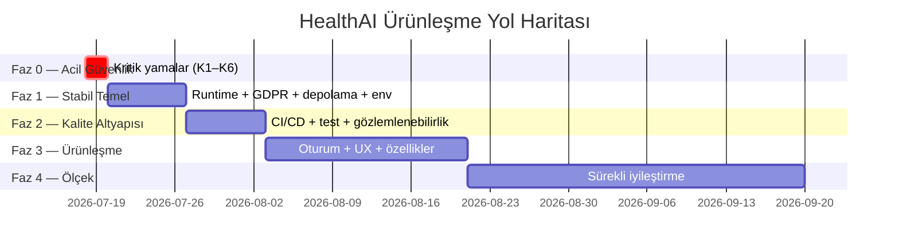

# HealthAI — Ürünleşme Yol Haritası

**Tarih:** 17 Temmuz 2026
**Hedef:** Projenin küresel, herkese açık, güvenli ve sürdürülebilir bir ürün olarak yayına alınması.
**Bağlam:** [ANALIZ-RAPORU.md](ANALIZ-RAPORU.md) · [IYILESTIRMELER.md](IYILESTIRMELER.md)

Fazlar sıralıdır: bir faz bitmeden bir sonrakine geçilmesi önerilmez. Süre tahminleri tek geliştirici, yarı zamanlı tempo içindir.

---

## Faz 0 — Acil Güvenlik Yaması 🔴 (1–2 gün)

**Amaç:** Bilinen açıkların istismar penceresini kapatmak. Bu faz bitmeden hiçbir ortam herkese açılmamalı.

| İş | Bulgu | Efor |
|---|---|---|
| MongoDB Atlas şifresi + JWT secret rotate; git geçmişinden `.env.atlas` temizliği (git filter-repo) | K2 | 2 sa |
| Register'dan `admin` rolünü kaldır + regresyon testi | K1 | 1 sa |
| `GET /api/meetings/:id` katılımcı kontrolü + test | K4 | 1 sa |
| `app.set('trust proxy', 1)` | K5 | 5 dk |
| Prod DB'de demo hesap şifrelerini rotate et / hesapları sil; LoginPage quick-login'i `import.meta.env.DEV`'e al; README'den şifreleri çıkar | K3 | 1 sa |
| OAuth şifre üretimini düzelt (hash'li random veya passwordsız model); e-posta ile otomatik hesap birleştirmeyi kapat | K6 | 2–3 sa |

**Çıkış kriteri:** ANALIZ-RAPORU §7 kontrol listesinin K1–K6 maddeleri işaretli; Railway'de login/rate-limit smoke testi geçiyor.

---

## Faz 1 — Stabil Yayın Temeli 🟠 (1 hafta)

**Amaç:** "Deploy edilebilir" değil, "deploy edilmiş ve ayakta kalan" ürün.

### 1a. Çalışma zamanı doğruluğu
- weeklyDigest sorgu düzeltmesi (Y5) + e-posta HTML escape (O9)
- Bildirim sistemi: `message_received` tipi + `notifPrefs` uygulaması (Y4)
- AI endpoint rate limit + `improvePost` JSON.parse guard (Y6)
- `escapeRegExp` tüm `$regex` kullanımlarında (Y8, O21)
- CORS reddi 403; socket.io origin listesini app.ts ile eşitle (O5, Y10)
- Graceful shutdown + unhandledRejection + Mongo bağlantı retry (O11)

### 1b. Veri ve GDPR
- Silme kaskadı: Message/Conversation/Comment/SavedSearch (Y1)
- `exportUserData` kapsam genişletme (Y1)
- Transaction fallback veya "Atlas zorunlu" kararının dokümantasyonu (Y2)
- Post silme kaskadı + comment post-existence kontrolü (O6, O7)
- Log koleksiyonuna 24 ay TTL (e-postadaki taahhütle uyum)

### 1c. Depolama
- Avatar depolamayı S3/R2'ye taşı (önerilen) **veya** Railway volume + nginx `/uploads` proxy (Y3)
- Git'ten avatar PNG'leri, log dosyaları, bozuk `C:` yolu temizliği (O2)

### 1d. Yapılandırma
- `API_BASE_URL` / `APP_BASE_URL` ayrımı; DEPLOY.md + compose + example güncellemesi (O3)
- Backend `.edu` doğrulaması (kural kalacaksa) + Zod tabanlı validation middleware'inin ilk üç şeması: register, profile, meeting (Y7, O8)
- Turnstile fail-open startup uyarısı (O18)

**Çıkış kriteri:** Railway + Vercel + Atlas üzerinde uçtan uca akış (kayıt → doğrulama maili → login → post → meeting → mesajlaşma → hesap silme) manuel test edildi; hesap silme sonrası DB'de kişisel veri kalmıyor.

---

## Faz 2 — Kalite ve Otomasyon Altyapısı 🟡 (1 hafta)

**Amaç:** Her değişikliğin güvenle gemiye binmesi.

- **CI/CD:** GitHub Actions — lint + `tsc` + test + build, PR zorunlu check; main'e merge → Railway/Vercel otomatik deploy (O17)
- **Lint:** ESLint (typescript-eslint, react-hooks) + Prettier; mevcut kodda tek seferlik `--fix` geçişi
- **Build hijyeni:** `tsconfig.build.json` (tests/scripts hariç) + vitest `dist/` exclude (O1)
- **Test genişletmesi:**
  - Backend: Faz 0-1 düzeltmeleri için regresyon paketi; conversations/notifications/comments suite'leri
  - Frontend: authStore + ProtectedRoute + kritik util testleri
  - Hedef: backend ≥ %70 satır kapsamı (controllers+services), frontend store/util %80
- **Bağımlılık güvenliği:** Dependabot + `npm audit` CI adımı
- **Gözlemlenebilirlik:** pino-http request logging, Sentry (iki taraf), UptimeRobot/BetterStack ping
- **Yedekleme:** Atlas otomatik backup planının doğrulanması + aylık restore tatbikatı notu

**Çıkış kriteri:** PR açıldığında kırmızı/yeşil CI; Sentry'de ilk gerçek hata görünür durumda; restore tatbikatı belgelendi.

---

## Faz 3 — Ürünleşme ve Kullanıcı Deneyimi 🟢 (2–3 hafta)

**Amaç:** Küresel kullanıcı tabanına profesyonel görünüm ve deneyim.

### 3a. Kimlik ve oturum
- Kısa ömürlü access token + httpOnly refresh cookie mimarisi (Y9)
- `passwordChangedAt` kontrolü; oturum listesi/"diğer cihazlardan çık" (opsiyonel)
- Hesap kilitleme (5 hatalı giriş → 15 dk) (O10)
- LinkedIn OAuth'un OIDC'ye taşınması veya kaldırılması; OAuth redirect'inde one-time code (O4)

### 3b. Frontend cila
- Bundle optimizasyonu: vendor chunk split, jspdf/html2canvas lazy import (O15)
- Font self-host (GDPR + LCP) ve ikon sistemi sadeleştirme
- SEO: meta/OG/favicon/sitemap/robots; `lang` senkronizasyonu; landing için SSG değerlendirmesi
- Vercel güvenlik başlıkları + CSP (IYILESTIRMELER §2.4)
- i18n tamamlama: 5 dilin anahtar eşitliği denetimi (eksik anahtar CI kontrolü), sağ dil seçiciyle dil kapsamının genişletilmesi

### 3c. Ürün özellikleri (README roadmap'i ile hizalı)
- WebSocket bildirim akışının tamamlanması (unread count canlı güncelleme — altyapı hazır)
- OpenAPI şeması (`zod-to-openapi` ile Faz 1'deki şemalardan üretim) + Swagger UI
- Konuşmalara dosya eki (S3 altyapısı Faz 1c'de kurulmuş olacak)
- E-posta digest'ine tek tık unsubscribe
- Admin paneli: platform sağlık göstergeleri, Gemini kota kullanımı

**Çıkış kriteri:** Lighthouse ≥ 90 (performans/erişilebilirlik/SEO), OpenAPI yayınlandı, bildirimler canlı.

---

## Faz 4 — Ölçek ve Süreklilik 🔵 (sürekli)

- **Ölçekleme hazırlığı:** cron'ların tek-instance flag'i (O19), rate limit store'unun Redis'e taşınması (çoklu replica), lastActive throttle LRU (O12)
- **Compliance derinleşmesi:** DPA/gizlilik politikası hukuki gözden geçirme, veri işleme envanteri, cookie consent'in gerçek kategori yönetimi, veri saklama politikası otomasyonu
- **Sağlık verisi pozisyonu:** platform PHI saklamıyor; "PHI yüklemeyin" kullanım şartı + mesaj içeriği için uyarı metni (NDA akışıyla tutarlı)
- **Performans:** Mongo index gözden geçirme (text search kullanımı vs regex filtreleri), sayfa başına sorgu sayısı ölçümü
- **Topluluk:** CONTRIBUTING.md, issue şablonları, CHANGELOG, sürümleme (semver + git tag)
- **AI genişlemesi:** Gemini çağrılarına kullanıcı-bazlı kota, sonuç önbelleği (aiMatch için TTL cache), model yükseltme değerlendirmesi

---

## Özet Zaman Çizelgesi

| Faz | Süre | Tema | Yayın durumu |
|---|---|---|---|
| 0 | 1–2 gün | Kritik güvenlik | ❌ Yayın yasak |
| 1 | 1 hafta | Stabilite + GDPR | ⚠️ Kapalı beta mümkün |
| 2 | 1 hafta | Otomasyon + izleme | ✅ Açık beta |
| 3 | 2–3 hafta | Ürünleşme | ✅ Genel yayın (GA) |
| 4 | Sürekli | Ölçek | ✅ Büyüme |
